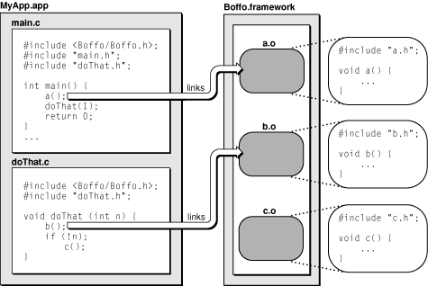

## [Framework Programming Guide](https://developer.apple.com/library/content/documentation/MacOSX/Conceptual/BPFrameworks/Frameworks.html#//apple_ref/doc/uid/10000183-SW1)


### 1. Anatomy of Framework Bundle

* Standard Framework
* Umbrella Framework

#### 1) Standard Framework

Single versioned framework

```
MyFramework.framework/
    MyFramework  -> Versions/Current/MyFramework
    Resources    -> Versions/Current/Resources
    Versions/
        A/
            MyFramework
            Resources/
                English.lproj/
                    InfoPlist.strings
                Info.plist
        Current  -> A
```

Multiple versiones framework

```
MyFramework.framework/
    MyFramework  -> Versions/Current/MyFramework
    Resources    -> Versions/Current/Resources
    Versions/
        A/
            MyFramework
            Resources/
                English.lproj/
                    InfoPlist.strings
                Info.plist
        B/
            MyFramework
            Resources/
                English.lproj/
                    InfoPlist.strings
                Info.plist
        Current  -> B
```

Note: symbolic at top-level is not neccessary, but useful for linking to Versions/Current/XXX, so update `Versions/Current` to A or B at one place

Multiple versioned framework with additional resources

```
MyFramework.framework/
    MyFramework  -> Versions/Current/MyFramework
    Resources    -> Versions/Current/Resources
    Versions/
        A/
            MyFramework
            Resources/
                English.lproj/
                    InfoPlist.strings
                Info.plist
        B/
            MyFramework
            Resources/
                English.lproj/
                    InfoPlist.strings
                Info.plist
        Current  -> B
```

Note: 


| Directory  | Description 
|:-----------|:-------------|
| Headers    |  Contains any public headers you want to make available to external developers. |
| Documentation | Contains HTML or PDF files describing the framework interfaces. Typically, documentation directories do not reside at the top level of your framework. Instead, they reside inside your language-specific resource directories. |
| Libraries | Contains any secondary dynamic libraries your framework requires. |

Framework configuration keys

| Key | Description |
|:----|:------------|
| CFBundleName | The framework display name |
| CFBundleIdentifier | The framework identifier (as a Java-style package name) |
| CFBundleVersion | The framework version |
| CFBundleExecutable | The framework shared library| 
| CFBundleSignature | The framework signature |
| CFBundlePackageType | The framework package type (which is always 'FMWK') |
| NSHumanReadableCopyright | Copyright information for the framework |
| CFBundleGetInfoString | A descriptive string for the Finder |

#### 2) Umbrella Framework

Differences from Standard Framework

* Header files are limited and maybe precompiled which makes faster builds
* Encapsulate subframeworks in `Frameworks` directory

Structure of the Core Services umbrella framework

```
CoreServices.framework/
    CoreServices           -> Versions/Current/CoreServices
    CoreServices_debug     -> Versions/Current/CoreServices_debug
    CoreServices_profile   -> Versions/Current/CoreServices_profile
    Frameworks             -> Versions/Current/Frameworks
    Headers                -> Versions/Current/Headers
    Resources              -> Versions/Current/Resources
    Versions/
        A/
            CoreServices
            CoreServices_debug
            CoreServices_profile
            Frameworks/
                CarbonCore.framework
                CFNetwork.framework
                OSServices.framework
                SearchKit.framework
                WebServicesCore.framework
            Headers/
                Components.k.h
                CoreServices-gcc3.p
                CoreServices-gcc3.pp
                CoreServices.h
                CoreServices.p
                CoreServices.pp
                CoreServices.r
            Resources/
                Info-macos.plist
                version.plist
        Current             -> A
```

Note: check more umbrella frameworks can see `/System/Library/Frameworks`

### 2. Lazy Linking Symbols

* dynamic link editor

Dynamic link editor resolves each undefined symbol only when the symbol is referenced by the program. If a symbol is not referenced, it is not bound to the program.



In this example, module `a.o` is linked in the program’s main routine when library function a is called. Module `b.o` is linked when library function b in program function doThat is called. Module `c.o` is never linked because its function is never called.

* Standalone Dynamic Shared Libraries

Stand-alone dynamic shared libraries have a `.dylib` extension and are typically installed in `/usr/lib`.

