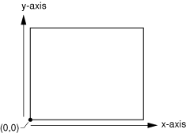
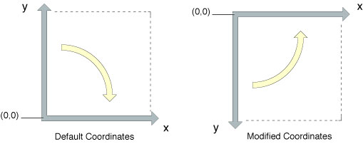
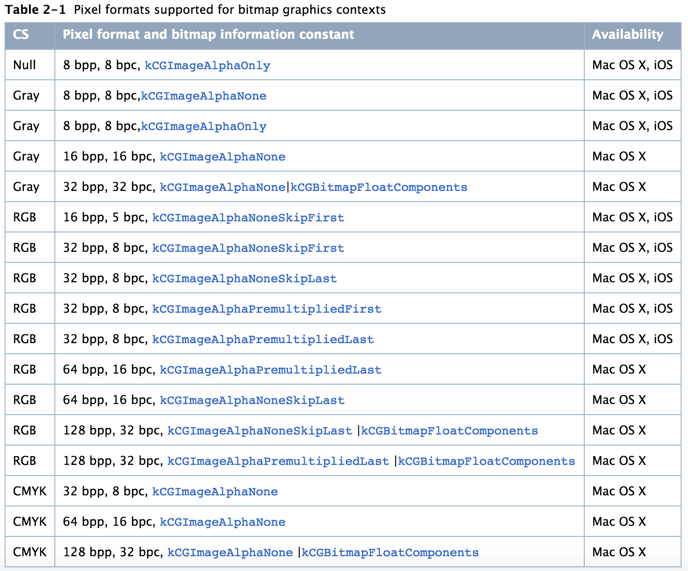

# Quartz 2D Programming Guide
--

TOC


## 1. Opaque Type

&nbsp;&nbsp;&nbsp;&nbsp;&nbsp;&nbsp;&nbsp;&nbsp;Apple文档中经常用到opaque type术语，它指的是数据类型包含的具体的数据结构没有定义在接口中，对使用接口的用户是不透明的（opaque）[^1]。

&nbsp;&nbsp;&nbsp;&nbsp;&nbsp;&nbsp;&nbsp;&nbsp;一般前向声明的类型都是opaque type类型，仅提供操作这种类型的方法或者函数[^2]。例如

```
// forward declaration of struct in C, C++ and Objective-C
struct Foo;

// forward declaration of class in C++:
class Bar;

// forward declaration of class in Objective-C:
@class Baz;

struct Foo *createFoo(void);
void addNumberToFoo(struct Foo *foo, int number);
void destroyFoo(struct Foo *foo);
```

## 2. Quartz 2D简介

&nbsp;&nbsp;&nbsp;&nbsp;&nbsp;&nbsp;&nbsp;&nbsp;Quartz 2D，是iOS和MacOS上的2D画图引擎，也是Core Graphics的另一种称呼，所以很多Quartz 2D的API使用CG前缀。

&nbsp;&nbsp;&nbsp;&nbsp;&nbsp;&nbsp;&nbsp;&nbsp;Quartz 2D使用painter模型，每次绘制（one page）都输出到一个画布（canvas）上，一旦page输出到画布上就不能修改，只能通过继续绘制page到画布上来修改最终效果。

下面是painter model


&nbsp;&nbsp;&nbsp;&nbsp;&nbsp;&nbsp;&nbsp;&nbsp;画布相当于Quartz 2D的输出目的地（或者输出设备），可以有不同的输出：      

* 当输出到打印机，page是一页纸上的图像    
* 当输出到PDF，page是虚拟的一页    
* 当输出到位图，page就是位图图像
* 当输出到Layer Context (CGLayerRef)，CGLayerRef允许关联另一个context做离屏渲染
* 当输出到MacOS上的Window graphics context，允许将绘制画到window上

## 3. Quartz 2D的Opaque Data Types

&nbsp;&nbsp;&nbsp;&nbsp;&nbsp;&nbsp;&nbsp;&nbsp;Quartz 2D提供一些数据类型，用于描述如何绘制。

* CGPathRef，用于矢量图形
* CGImageRef，用于位图图形
* CGLayerRef，用于代表一个绘制层，可以重复使用这个绘制层（例如画背景、pattern图案等），也可以用作离屏渲染
* CGPatternRef，用于pattern图案，就是那种平铺重复某个图形形成的图画（想象一下，瓷砖的效果）
* CGShadingRef和CGGradientRef，用于绘制渐变
* CGFunctionRef，用于定义回调函数
* CGColorRef和CGColorSpaceRef，用于描述颜色，Quartz会用它们来解析颜色
* CGImageSourceRef和CGImageDestinationRef，用于移动Quartz的数据
* CGFontRef，用于画字体
* CGPDFDictionaryRef, CGPDFObjectRef, CGPDFPageRef, CGPDFStream, CGPDFStringRef和CGPDFArrayRef, 用于PDF的元数据
* CGPDFScannerRef和CGPDFContentStreamRef，用于解析PDF的元数据
* CGPSConverterRef，用于将PostScript转成PDF。iOS上不可用这个。

## 4. Quartz 2D的坐标系

&nbsp;&nbsp;&nbsp;&nbsp;&nbsp;&nbsp;&nbsp;&nbsp;Quartz 2D的坐标系和UIKit中的坐标系不一样，它的坐标系原点是左下角，如下



> 
Quartz 2D的坐标系的值使用浮点数。

&nbsp;&nbsp;&nbsp;&nbsp;&nbsp;&nbsp;&nbsp;&nbsp;由于Quartz 2D的设备无关性，Quartz 2D采用上面自己的坐标系，并定义这个坐标系为用户空间（user space），而对应的输出设备（打印机、位图、PDF等）则是设备空间（device space）。

&nbsp;&nbsp;&nbsp;&nbsp;&nbsp;&nbsp;&nbsp;&nbsp;Quartz 2D使用`CTM`（current transformation matrix）来定义如何从user space映射到device space。CTM是一种特殊的矩阵，又称为仿射变换（affine transform），可以映射点做一些移动（translation）、旋转（rotation）、缩放（scaling）等操作。

&nbsp;&nbsp;&nbsp;&nbsp;&nbsp;&nbsp;&nbsp;&nbsp;除了映射坐标系，CTM还可以帮助画某些需要旋转的图形，例如画一个旋转45°的矩形，不用直接画旋转45°的矩形，而是画水平的矩形，使用CTM将user space旋转45°，这样画到device space中就是旋转45°的矩形。

和Quartz 2D的坐标系相对的，是修改过的坐标系（modified coordinate system），例如

* In Mac OS X, a subclass of NSView that overrides its isFlipped method to return YES.
* In iOS, a drawing context returned by an UIView.
* In iOS, a drawing context created by calling the UIGraphicsBeginImageContextWithOptions function.

上面的坐标系的原点都是左上角。

&nbsp;&nbsp;&nbsp;&nbsp;&nbsp;&nbsp;&nbsp;&nbsp;如果在上面drawing context使用Quartz 2D的context，则需要将坐标系转换一下，即把y轴翻转下，如下




## 5. Quartz 2D的内存管理

Quartz 2D使用Core Foundation的内存管理模型，也就是手动引用计数。

* 使用函数（带Create或者Copy）创建对象，则使用者负责释放
* 使用函数（不带Create或者Copy）获取对象，则函数本身负责释放
* 如果使用函数获取对象，而且需要持有，则使用者retain对象，同时也负责释放对象

>
例如有CGColorspace对象，可以对应的API， CGColorSpaceRetain和CGColorSpaceRelease持有和释放，也可以使用通用的方式CFRetain和CFRelease，但注意不能向这些函数传NULL参数。

## 6. Graphics Context

&nbsp;&nbsp;&nbsp;&nbsp;&nbsp;&nbsp;&nbsp;&nbsp;一个Graphics context代表绘制的目的地，它自己包含一些绘制参数（颜色、剪裁区域、线条宽度以及类型、字体信息、合成选项等）以及设备相关的信息。Quartz 2D使用`CGContextRef`类型代表graphics context。

&nbsp;&nbsp;&nbsp;&nbsp;&nbsp;&nbsp;&nbsp;&nbsp;获取graphics context可以使用Quartz的函数或者Mac OS X中framework以及UIKit提供的高层API。根据输出设备的不同，获取graphics context的方式也不同。

### 6.1 在iOS中获取Graphics Context (View Context)

&nbsp;&nbsp;&nbsp;&nbsp;&nbsp;&nbsp;&nbsp;&nbsp;在iOS中可以通过实现UIView的drawRect:方法来完成绘制，在该方法中使用UIKit的`UIGraphicsGetCurrentContext`获取已经配置好的graphics context，该context采用UIKit的modified coordinate system，即原点在左上角。如果需要将原点移动到view的左下角，则需要采用两个步骤：1. 将原点移动到(0, rect.size.height)；2. 将y轴从down翻转到up方向。

```
- (void)drawRect:(CGRect)rect {
    CGContextRef viewContext = UIGraphicsGetCurrentContext();
    
    // Note: convert UIKit coordinate system into Quartz 2D coordinate system
    // and move origin to view's bottom-left corner
    CGContextTranslateCTM(viewContext, 0, rect.size.height);
    CGContextScaleCTM(viewContext, 1, -1);
    
    // now viewContext use Quartz 2D coordinate system
    // ...
}
```

当UIView显示时并且它的内容需要更新，则会调用drawRect:方法。在调用该方法前，UIView自动创建配置好的view context。值得注意的是，view context有自己的大小，而且rect大小不一致。

### 6.2 在MacOS中创建window graphcis context

和iOS中获取过程类似，实现NSView的drawRect:方法，使用下面代码获取CGContextRef对象

```
CGContextRef myContext = [[NSGraphicsContext currentContext] graphicsPort];
```

### 6.3 创建PDF graphcis context

Quartz 2D提供两种API用于创建PDF graphics context

* `CGPDFContextCreateWithURL`，可以指定一个URL地址用于存放PDF
* `CGPDFContextCreate`，没有指定URL地址，但可以指定data consumer，用于传递PDF数据

使用CGPDFContextCreateWithURL的例子，如下

```
CGContextRef MyPDFContextCreate (const CGRect *inMediaBox,
                                    CFStringRef path)
{
    CGContextRef myOutContext = NULL;
    CFURLRef url;
 
    url = CFURLCreateWithFileSystemPath (NULL,
                                path,
                                kCFURLPOSIXPathStyle,
                                false);
    if (url != NULL) {
        myOutContext = CGPDFContextCreateWithURL (url,
                                        inMediaBox,
                                        NULL);
        CFRelease(url);
    }
    return myOutContext;
}
```

使用CGPDFContextCreate的例子，如下

```
CGContextRef MyPDFContextCreate (const CGRect *inMediaBox,
                                    CFStringRef path)
{
    CGContextRef        myOutContext = NULL;
    CFURLRef            url;
    CGDataConsumerRef   dataConsumer;
 
    url = CFURLCreateWithFileSystemPath (NULL,
                                        path,
                                        kCFURLPOSIXPathStyle,
                                        false);
 
    if (url != NULL)
    {
        dataConsumer = CGDataConsumerCreateWithURL (url);
        if (dataConsumer != NULL)
        {
            myOutContext = CGPDFContextCreate (dataConsumer,
                                        inMediaBox,
                                        NULL);
            CGDataConsumerRelease (dataConsumer);
        }
        CFRelease(url);
    }
    return myOutContext;
}
```

### 6.4 创建位图graphcis context

在iOS中有两种方式可以创建一个位图graphcis context，如下

* `UIGraphicsBeginImageContextWithOptions`，UIKit提供的函数，采用UIKit的左上角坐标系，它带三个参数
	* size，位图context的大小
	* opaque，是否不透明的。如果YES，则位图没有alpha通道；如果NO，则位图包含alpha通道
	* scale，位图的缩放。如果设置0.0，则默认采用设备分辨率，例如2x、3x等
	
* `CGBitmapContextCreate`，CoreGraphics提供的函数，采用Quartz 2D的左下角坐标系，用起来比UIGraphicsBeginImageContextWithOptions要复杂一点。
	* data，位图数据的buffer，大小至少是(bytesPerRow * height)个byte
	* width，位图的宽度，单位像素
	* height，位图的高度，单位像素
	* bitsPerComponent，每个通道的比特数。例如RGB的每个通道是8个比特。
	* bytesPerRow，位图每一行的字节数。一般来说，它的大小是(width * 4)个字节数，但是存在字节对齐，因此官方推荐bytesPerRow按照16 bytes对齐，这样性能是最优的。
	* colorspace，位图的颜色空间，一般有Gray、RGB、CMYK或者NULL
	* bitmapInfo，位图其他信息，CGBitmapInfo类型和CGImageAlphaInfo类型的组合。例如控制颜色通道的顺序，是ARGB，还是RGBA。

> 
使用UIGraphicsBeginImageContextWithOptions创建的位图，其格式是ARGB 32位。    
如果opaque为YES，bitmapInfo是`kCGImageAlphaNoneSkipFirst | kCGBitmapByteOrder32Host`。    
如果opaque为NO，bitmapInfo是`kCGImageAlphaPremultipliedFirst | kCGBitmapByteOrder32Host`。

使用UIGraphicsBeginImageContextWithOptions的例子，如下

```
- (void)drawRect:(CGRect)rect {
    CGContextRef viewContext = UIGraphicsGetCurrentContext();
    
    UIGraphicsBeginImageContextWithOptions(rect.size, NO, 0.0);
    {
        CGContextRef bitmapContext = UIGraphicsGetCurrentContext();
        [self drawGraphicsInBitmapContext:bitmapContext viewContext:viewContext viewBoundingRect:rect];
    }
    UIGraphicsEndImageContext();
}
```

使用CGBitmapContextCreate的例子，如下

```
CGContextRef MyBitmapContextCreate(int widthInPixel, int heightInPixel)
{
    CGContextRef context = NULL;
    CGColorSpaceRef colorSpace;
    void *bitmapData;
    int bitmapByteCount;
    int bitmapBytesPerRow;
    
    bitmapBytesPerRow = widthInPixel * 4;
    bitmapByteCount = bitmapBytesPerRow * heightInPixel;
    
    colorSpace = CGColorSpaceCreateWithName(kCGColorSpaceGenericRGB);
    bitmapData = calloc(bitmapByteCount, sizeof(uint8_t));
    
    if (bitmapData == NULL) {
        fprintf(stderr, "memory not allocated");
        return NULL;
    }
    
    context = CGBitmapContextCreate(bitmapData, widthInPixel, heightInPixel, 8, bitmapBytesPerRow, colorSpace, kCGImageAlphaPremultipliedLast);
    if (context == NULL) {
        free(bitmapData);
        fprintf(stderr, "context not created");
        return NULL;
    }
    CGColorSpaceRelease(colorSpace);
    
    return context;
}
```

## 7. Quartz 2D支持的像素格式



上面的几个缩写词

* cs，color space
* bpp，bits per pixel
* bpc，bits per component

## TODO

* Quartz 2D的Graphics States

References
--

[^1]: https://en.wikipedia.org/wiki/Opaque_data_type
[^2]: https://stackoverflow.com/questions/735131/what-does-the-term-opaque-type-mean-in-the-context-of-cfbundleref-opaque-type
