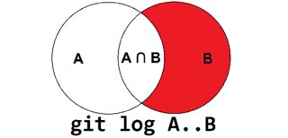
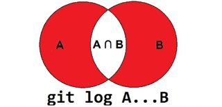

# git手册

[TOC]

## 1、git选项

### `--exec-path`

作用：输出git-core目录

示例：

```shell
$ git --exec-path
/Applications/Xcode.app/Contents/Developer/usr/libexec/git-core
```


## 2、git子命令

一般情况下，git子命令都在git仓库中使用，但是不能`.git`文件夹下面使用，否则git子命令不能正常工作。

举个例子，如下

```shell
$ cd .git
➜  .git git:(master) git rev-parse --show-toplevel
➜  .git git:(master) git status
fatal: this operation must be run in a work tree
```


### (1) branch

#### a. 删除其他分支

本地删除当前分支以外的其他分支，使用下面的命令

```shell
$ git branch -d `git branch | grep -v \\* | xargs`
```

注意

> 该命令不会删除远端分支


#### b. 查询某个commit在哪些分支上

参考这个SO[^28]的做法，如下

* 检查本地分支

```shell
$ git branch --contains <commit>
```

* 检查远程分支

```shell
$ git branch -r --contains <commit>
```

如果需要过滤特定的分支，结合grep使用，如下

```shell
$ git branch -r --contains <commit> | grep -e "someBranch"
```


### (2) clone

如果git仓库包含submodule，clone时可以增加`--recursive`选项，将submodule同时clone下来。例如

```shell
$ git clone --recursive https://github.com/DeVaukz/MachO-Explorer
```


#### a. git clone同时clone submodule

参考这个SO的回答[^26]，有两种方式

* 使用两个命令，如下

  ```shell
  $ git clone git@xxx.com:yourName/someLibrary.git
  $ cd someLibrary
  $ git submodule update --init --recursive
  ```

  > `git submodule update --init --recursive`命令需要cd到git仓库下面执行

* 使用一个命令，如下

  ```shell
  $ git clone --recurse-submodules -j8 git@xxx.com:yourName/someLibrary.git
  ```

  > `-j8`控制同时clone submodule的个数

由于上面两个命令，参数比较多，可以采用git alias方式简化一下。

使用`git config --global`配置git alias，如下

```shell
$ git config --global alias.rclone 'clone --recurse-submodules -j8'
$ git config --global alias.submodule.update 'submodule update --init --recursive'
```


### (3) commit

#### a. 修改最近提交commit的信息

如果最近一次提交的信息，需要修改。可以执行下面的命令[^27]

```shell
$ git commit --amend -m "New commit message"
$ git push --force
```

> 也可以执行git commit --amend，唤起vim编辑器，基于之前的内容，做更新


### (4) config

格式：`git config [<options>]`

说明：用于设置和查询git的配置

git的config，分为下面三个级别[^4]

* project，配置存放在git仓库`.git/config`文件中，配置仅对当前git仓库有效
* global，配置存放在git仓库`~/.gitconfig`文件中，配置对当前用户的所有git仓库有效
* system，配置存放在git仓库`/etc/gitconfig`文件中，配置对所有用户的所有git仓库有效


访问project级别的config配置

```shell
$ cd <git repo>; git config user.name "John Doe" 
或者
$ git config --file path/to/<git repo>/.git/config user.name "John Doe" 
```


访问global级别的config配置

```shell
$ git config --global user.name "John Doe"
```


访问system级别的config配置

```shell
$ git config --system user.name "John Doe"
```


#### a. git pull自动更新submodule

如果git仓库添加submodule，默认git pull，不会git clone这个仓库，也不会更新这个submodule。配置下面命令，可以自动更新submodule[^25]

```shell
$ git config --global submodule.recurse true
```


### (5) fetch

#### a. 强制同步远端的tag

使用下面命令[^24]，如下

```shell
$ git fetch --tags --force
```

说明

> 执行git fetch --tags --prune origin，可能会报错“would clobber existing tag”，是因为本地和远端存在同名的tag，出现这种原因可能是远端同名的tag，被删除然后在新的commit上打tag，导致本地和远端有同名的tag，但是对应的commit不一样。使用`--force`选项，强制同步远端的tag


### (6) diff

格式：

```shell
git diff [<options>] [<commit>] [--] [<path>...]
git diff [<options>] --cached [<commit>] [--] [<path>...]
git diff [<options>] <commit> <commit> [--] [<path>...]
git diff [<options>] <blob> <blob>
git diff [<options>] --no-index [--] <path> <path>
```

说明：Show changes between commits, commit and working tree, etc

用例：

#### a. --diff-filter=ADR

查看当前分支对应的远程分支是否文件改动（A/D/R）[^3]

```shell
$ git fetch
$ git diff --diff-filter=ADR --name-only master origin/master
```

基于本地分支master，和远程master分支比较，查找出新增加文件（A）、删除文件（D）和重命名文件（R）

> 需要提前fetch一下，获取远程分支的信息


#### b. --cached --name-status

查看Staged File列表[^7]

Staged File列表，是指准备要提交的文件列表。

使用下面命令，可以查看哪些要提交的文件

```shell
$ git diff --cached --name-status
M       README.md
A       WCMacroKit/test.h
```


#### diff选项

```shell
git diff --name-only
path/to/modified/file
path/to/renamed/file


# list the names and change statuses:
git diff --name-status
M       path/to/modified/file
R100    path/to/existing/file   path/to/renamed/file


# list a diffstat-like output (+ed lines, -ed lines, file name):
git diff --numstat
1       0       path/to/modified/file
0       0       path/to/{existing => renamed}/file
```


https://stackoverflow.com/a/21724628


### (7) log

格式：`git log [<options>] [<revision range>] [[--] <path>...]`

说明：查看log

用例：

#### a.  --author

查看某个或多个用户的log[^1]

```shell
$ git log --author='<username>'
$ git log --author='<username1>' --author='<username2>'
$ git log --author='<email.username@company.com>'
```


> --author参数，除了可以指定用户名，还可以指定用户的email


#### b. tagA...tagB & tagA..tagB

列出2个tag之间的commit[^14]

```shell
$ git log --pretty=oneline tagA...tagB
$ git log --pretty=oneline tagA..tagB
```

使用上面的格式，可以列出2个tag之间的commit。

但是`..`和`...`有比较大的区别。

* `..`，从tagA到tagB，不包括哪些commit能reach到tagA，仅包括commit能reach到tagB。如下图





`git log a..b`

> means give me all commits that were made since a, until and including b (or, like the man page puts it "Include commits that are reachable from b but exclude those that are reachable from a"), the three-dot variant


* `...`，从tagA到tagB，不包括哪些commit既能reach到tagA，有能reach到tagB，仅包括commit能reach到tagA，或者commit能reach到tagB。如下图




`git log a...b`

> means "Include commits that are reachable from either a or b but exclude those that are reachable from both", which is a totally different thing.


`--pretty=oneline`没有时间和作者信息，可以采用自定义格式的方式[^16]，如下

```shell
$ git log --pretty=format:"%h%x09%an%x09%ad%x09%s" tagA...tagB
```


### (8) rev-parse

格式：`git rev-parse [<options>] <args>...`

说明：Pick out and massage parameters

用例：

#### a. --abbrev-ref HEAD

查看当前分支[^2]

```shell
$ git rev-parse --abbrev-ref HEAD
```


#### b. HEAD

查看当前commit[^6]

```shell
$ git rev-parse HEAD
```


#### c. --show-toplevel

查看当前Git根目录路径[^8]

```shell
$ git rev-parse --show-toplevel
```


### (9) remote

#### a. remote add


```shell
$ git remote
origin
$ git remote add Aspects https://github.com/steipete/Aspects.git
$ git remote 
Aspects
origin
```


#### b. remote show

格式[^17]如下

```shell
$ git remote show <remote-name>
```


### (10) stash

格式：`git stash \<subcommand\>`

说明：管理本地stash，常用子命令有list

用例：

#### a. stash list

git stash list，查看stash列表

```shell
$ git stash list --date=local
stash@{Mon Apr 16 15:09:01 2018}: On release/180427/master: temp2
stash@{Tue Apr 3 19:17:27 2018}: On release/180427/master: temp3
```

> --date=local，显示存储的时间


## 3、使用git hook

​       git hook是在git执行特定命令或者过程中，允许执行用户的脚本。git hook的脚本，位于`.git/hooks`目录下面，一般会有`.sample`后缀的示例脚本。

​       git hook的脚本，有特定的文件名，用于hook那个过程，同时脚本需要可执行权限。常用的hook名[^5]，如下

| 脚本名                                                       | 作用 |
| ------------------------------------------------------------ | ---- |
| [applypatch-msg](https://github.com/git/git/blob/master/templates/hooks--applypatch-msg.sample) |      |
| [pre-applypatch](https://github.com/git/git/blob/master/templates/hooks--pre-applypatch.sample) |      |
| [post-applypatch](https://www.git-scm.com/docs/githooks#_post_applypatch) |      |
| [pre-commit](https://github.com/git/git/blob/master/templates/hooks--pre-commit.sample) |      |
| [prepare-commit-msg](https://github.com/git/git/blob/master/templates/hooks--prepare-commit-msg.sample) |      |
| [commit-msg](https://github.com/git/git/blob/master/templates/hooks--commit-msg.sample) |      |
| [post-commit](https://www.git-scm.com/docs/githooks#_post_commit) |      |
| [pre-rebase](https://github.com/git/git/blob/master/templates/hooks--pre-rebase.sample) |      |
| [post-checkout](https://www.git-scm.com/docs/githooks#_post_checkout) |      |
| [post-merge](https://www.git-scm.com/docs/githooks#_post_merge) |      |
| [pre-receive](https://www.git-scm.com/docs/githooks#pre-receive) |      |
| [update](https://github.com/git/git/blob/master/templates/hooks--update.sample) |      |
| [post-receive](https://www.git-scm.com/docs/githooks#post-receive) |      |
| [post-update](https://github.com/git/git/blob/master/templates/hooks--post-update.sample) |      |
| [pre-auto-gc](https://www.git-scm.com/docs/githooks#_pre_auto_gc) |      |
| [post-rewrite](https://www.git-scm.com/docs/githooks#_post_rewrite) |      |
| [pre-push](https://www.git-scm.com/docs/githooks#_pre_push)  |      |


// TODO

https://stackoverflow.com/questions/3442874/in-git-how-can-i-write-the-current-commit-hash-to-a-file-in-the-same-commit


## 4、常用git alias

### (1) 配置.gitconfig文件

在`~/.gitconfig`文件中，找到下面section进行配置[^9]

```properties
[alias]
    <shortcut> = <actual command>
    st = status
    ci = commit -v
```

如果`.gitconfig`文件的格式有问题，执行git --version命名会报错，如下


```shell
$ git --version
fatal: bad config line 15 in file ~/.gitconfig
```


由于`.gitconfig`有特定格式，而且gti版本不同，这个文件的格式可能存在差异。应该使用`git config --global`命令进行配置别名。

举个例子，如下

```shell
$ git config --global alias.removeLocalOtherBranch 'branch -d `git branch | grep -v '*' | xargs`'
```


### (2) 常用git alias示例

```properties
[alias]
    remove_local_other_branch = branch -d `git branch | grep -v \* | xargs`
    rclone = clone --recurse-submodules -j8
[alias "submodule"]
	update = submodule update --init --recursive
```

* remove_local_other_branch，删除非当前分支的其他本地分支[^10]

* rclone，clone仓库的的同时，递归clone submodule
* submodule.update，clone仓库时忘记拉取submodule，可以使用这个命令clone或更新submodule


## 5、常见任务

### (1) 修改MacOS默认git[^11]

MacOS自带git命令行工具，如下

```shell
$ git --version
git version 2.24.1 (Apple Git-126)
```


可以使用brew安装git，并将git命令重新链接到新git工具

```shell
$ brew install git
$ brew link --force git
Warning: Already linked: /usr/local/Cellar/git/2.26.1
To relink:
  brew unlink git && brew link git
```


重启terminal，检查git版本，如下

```shell
$ git --version
git version 2.26.1
```


### (2) 查找被删除的文件

​       Git仓库中有文件被其他人删除，但是自己需要找到这个文件。可以使用下面的命令[^12]来找到这个文件commit记录，一般来说，最近一个commit中，这个文件被删除掉了。

```shell
$ git log --full-history -- path/to/file
```

上面命令要求，输入准确的被删除文件的相对路径。但是时间久了，这个路径并不知道，只是知道文件名而已，因此这个命令不太管用。

可以使用下面命令[^13]来进行搜索，被删除文件的commit记录，如下

```shell
$ git log --full-history -- "**/deleted_file_name.*"
```

说明

> git log是否添加`--all`选项，SO评论[^13]中添加此选项，可以在其他分支进行搜索，但是实际上操作，发现搜索到的commit有些和删除的文件没有关系。而且最新的commit也不是删除文件的那个commit。


TODO

core.sparsecheckout


### (4) 复制一个仓库

GitHub上提供fork功能，可以将别人的库复制到自己的名下。但是如果要复制一个仓库（包括提交记录等信息）到GitLab上，则需要自己做一些处理。

主要步骤，如下

* 创建一个remote，关联到GitHub仓库的url
* 查询GitHub仓库的远端分支
* 拉取GitHub仓库的远端分支

* 基于GitHub仓库的远端分支，创建新的分支，做修改

举个例子，如下

```shell
// 1. 创建一个remote
$ git remote add Aspects https://github.com/steipete/Aspects.git
$ git remote 
Aspects
origin
// 2. 查询GitHub仓库的远端分支
$ git remote show Aspects      
* remote Aspects
  Fetch URL: https://github.com/steipete/Aspects.git
  Push  URL: https://github.com/steipete/Aspects.git
  HEAD branch: master
  Remote branches:
    master            new (next fetch will store in remotes/Aspects)
    peter/alloc-hooks new (next fetch will store in remotes/Aspects)
    peter/trampolines new (next fetch will store in remotes/Aspects)
  Local ref configured for 'git push':
    master pushes to master (local out of date)
// 3.a 拉取GitHub仓库的远端分支
$ git pull Aspects master

// 3.b git fetch <remote> <rbranch>:<lbranch>，将远端分支拉取到本地分支[^18]
$ git fetch Aspects master:temp
$ git merge temp --allow-unrelated-histories
```

使用--allow-unrelated-histories选项[^19]，解决代码合并问题


### (5) 使用ssh访问GitHub[^20]

GitHub上的git仓库已经废弃https访问的方式，需要使用ssh方式。

需要下面几个步骤

* Mac电脑上生成RSA key
* 配置config
* GitHub账号的设置添加public key

举个例子，如下

```shell
$ cd ~/.ssh
$ ssh-keygen -t rsa -b 4096 -C "your_email@example.com"
> Enter a file in which to save the key (/Users/you/.ssh/id_rsa): [Press enter]
<id_rsa_gh>
$ vim ~/.ssh/config
Host *
  AddKeysToAgent yes
  UseKeychain yes
  IdentityFile ~/.ssh/id_rsa_gh
$ cat ~/.ssh/id_rsa_gh.pub
```

当生成private key和public key时，可以重新去一个名字，比如id_rsa_gh。然后配置config文件，设置id_rsa_gh的文件路径。

最后查看id_rsa_gh.pub的内容，将这个复制粘贴到GitHub账号的设置中。


说明

> 如果完成上面几步，提示下面没有权限
>
> ```shell
> $ git push
> ERROR: Permission to xxx/your_repository.git denied to XTShow.
> fatal: Could not read from remote repository.
> 
> Please make sure you have the correct access rights
> ```
>
> 则可以尝试下面的命令[^21]，如下
>
> ```shell
> $ ssh-add ~/.ssh/id_rsa_gh2
> Identity added: /Users/xxx/.ssh/id_rsa_gh2 (your_email@example.com)
> ```
>
> 


### (6) 诊断git的ssh连通性

诊断git的ssh连通性[^22]，如下

```shell
$ ssh -vT git@github.com
```


### (7) 克隆仓库中某个commit

如果git仓库用于存放二进制文件，那么有可能因为二进制变化，导致这个仓库的历史版本有不同二进制文件。如果完整clone这个仓库，会发现这个仓库很大，导致下载速度很慢。

如果只需要特定commit的二进制文件下载，则可以考虑只clone仓库中某个commit。

* 总是取仓库最新的二进制文件，这里`<depth>`设置为1即可[^29]

```shell
$ git clone --depth <depth> -b <branch> <repo_url>
```

* 获取特定commit的二进制文件[^30]

```shell
$ git init
$ git remote add origin <url>
$ git fetch --depth 1 origin <sha1>
$ git checkout FETCH_HEAD
```


### (8) 查看git仓库下所有submodules

git仓库下所有submodules，都配置在`.gitmodules`文件中，可以直接用文本编辑器查看。

另外使用命令也可以查看有哪些submodule[^31]

* 使用git config命令

```shell
$ git config --file .gitmodules --name-only --get-regexp path
```

或者

```shell
$ git config --file .gitmodules --get-regexp path | awk '{ print $2 }'
```

* 使用git submodule命令

```shell
$ git submodule status --recursive
```


## 6、git常见报错

### (1) git-ssh: connect to host github.com port 22: Connection timed out

执行git pull时，报下面的错误，如下

```shell
$ git pull
ssh: connect to host github.com port 22: Connection timed out
fatal: Could not read from remote repository.
```

解决方法[^23]：

* 测试可用性

```shell
$ ssh -T -p 443 git@ssh.github.com
The authenticity of host '[ssh.github.com]:443 ([a.b.c.d]:443)' can't be established.
ED25519 key fingerprint is SHA256:<abcdedfgh...>.
This key is not known by any other names
Are you sure you want to continue connecting (yes/no/[fingerprint])? yes
Warning: Permanently added '[ssh.github.com]:443' (ED25519) to the list of known hosts.
Hi XXX! You've successfully authenticated, but GitHub does not provide shell access.
```

提示Hi XXX! You've successfully authenticated, but GitHub does not provide shell access.说明可用

* 编辑`~/.ssh/config`文件，增加内容，如下

```properties
Host github.com
Hostname ssh.github.com
Port 443
```

* 再次测试

```
$ ssh -T git@ssh.github.com
```

最后git pull应该是成功的。


### (2) 报错WARNING: REMOTE HOST IDENTIFICATION HAS CHANGED!

执行git pull时，报下面的错误，如下

```shell
$ git pull
WARNING: REMOTE HOST IDENTIFICATION HAS CHANGED!
...
```

解决方法[^24]：

```shell
$ ssh-keygen -R github.com
```


## References

[^1]: https://stackoverflow.com/questions/4259996/how-can-i-view-a-git-log-of-just-one-users-commits 
[^2]:https://stackoverflow.com/a/12142066
[^3]: https://stackoverflow.com/a/32540714

[^4]: https://stackoverflow.com/a/16682441

[^5]:https://githooks.com/
[^6]:https://stackoverflow.com/a/3443485

[^7]:https://stackoverflow.com/a/2413151
[^8]:https://stackoverflow.com/a/957978

[^9]:https://stackoverflow.com/questions/2553786/how-do-i-alias-commands-in-git
[^10]:https://stackoverflow.com/questions/10610327/delete-all-local-git-branches
[^11]:https://medium.com/@katopz/how-to-upgrade-git-ff00ea12be18

[^12]:https://stackoverflow.com/questions/6839398/find-when-a-file-was-deleted-in-git
[^13]:https://stackoverflow.com/a/7203551

[^14]:https://stackoverflow.com/questions/5863426/get-commit-list-between-tags-in-git/33579952
[^15]:https://stackoverflow.com/questions/35286480/how-to-list-commits-directly-between-two-tags
[^16]:https://stackoverflow.com/questions/1441010/the-shortest-possible-output-from-git-log-containing-author-and-date

[^17]:https://stackoverflow.com/a/15630478
[^18]:https://stackoverflow.com/a/16095458
[^19]:https://www.educative.io/edpresso/the-fatal-refusing-to-merge-unrelated-histories-git-error

[^20]:https://docs.github.com/en/authentication/connecting-to-github-with-ssh/generating-a-new-ssh-key-and-adding-it-to-the-ssh-agent#adding-your-ssh-key-to-the-ssh-agent

[^21]:https://stackoverflow.com/a/41521358

[^22]:https://stackoverflow.com/a/8610435

[^23]:https://www.jianshu.com/p/c3aac5024877
[^24]:https://stackoverflow.com/questions/75830783/warning-remote-host-identification-has-changed-did-github-change-their-rsa

[^25]:https://stackoverflow.com/questions/4611512/is-there-a-way-to-make-git-pull-automatically-update-submodules

[^26]:https://stackoverflow.com/questions/3796927/how-do-i-git-clone-a-repo-including-its-submodules
[^27]:https://stackoverflow.com/a/20853093

[^28]:https://stackoverflow.com/questions/1419623/how-to-list-branches-that-contain-a-given-commit

[^29]:https://stackoverflow.com/questions/29368837/copy-a-git-repo-without-history
[^30]:https://stackoverflow.com/questions/31278902/how-to-shallow-clone-a-specific-commit-with-depth-1
[^31]:https://stackoverflow.com/questions/12641469/list-submodules-in-a-git-repository

