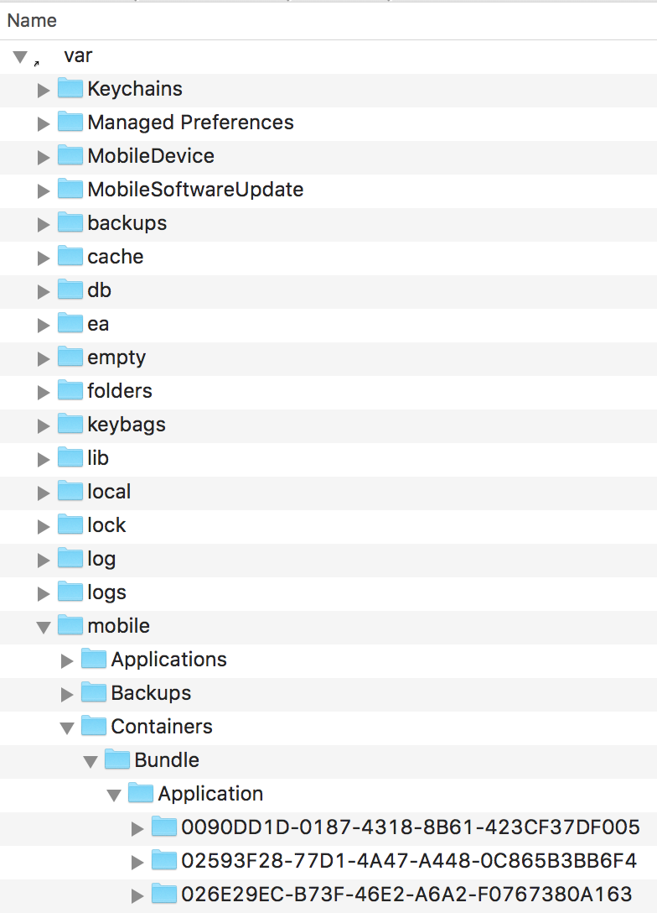
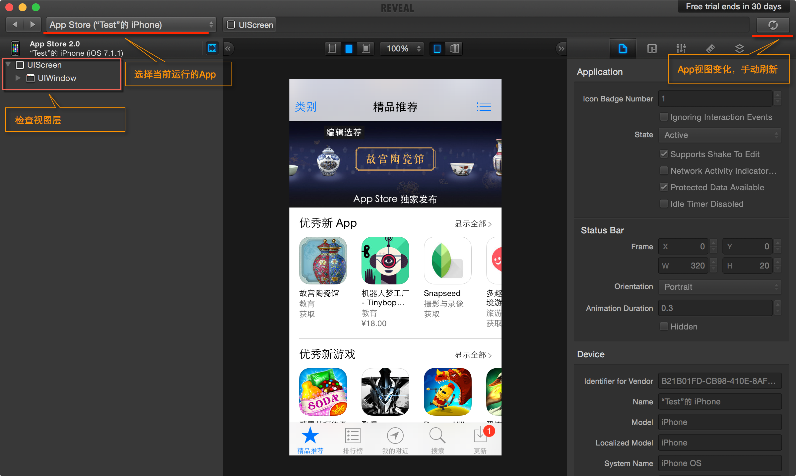
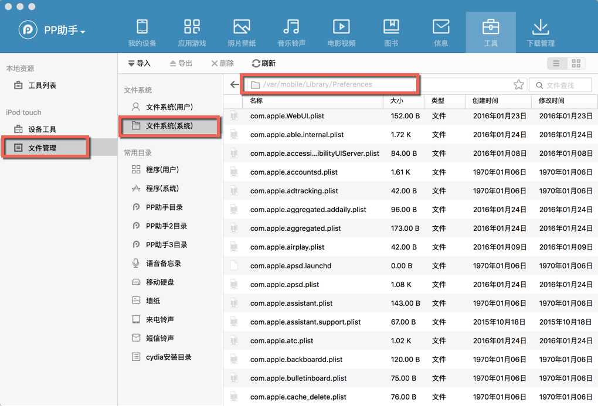
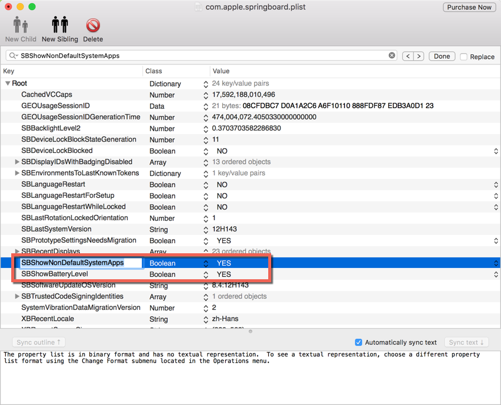
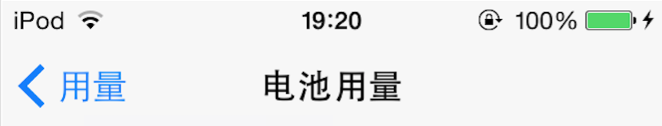

# iOS jailbreak

[TOC]


## 1、iOS 9.3.5 jailbreak[^1]

操作步骤

1. Safari打开m.pandahelp.vip/regular，安装描述文件“Panda Helper Lite”，然后继续安装Panda Helper.app
2. 打开Panda Helper.app，搜索Phoenix jailbreak tool，点击install，提示下载安装，完成后桌面多出Phoenix.app
3. 打开Phoenix.app，点击“Prepare For Jailbreak”，一路点下去，出现提示“Device Supported”，选择“Use Provided Offsets”，继续点，最后系统重启，桌面出现Cydia.app，说明越狱OK。


## 2、iOS 10.3.3 jailbreak[^11]

操作步骤

1. Safari打开https://cydia-app.com/panda-helper/，点击“Download Link 1”或者“Download Link 2”，安装描述文件“Panda Helper Lite”，然后继续安装Panda Helper.app
2. 打开Panda Helper.app，搜索h3lix，点击install，提示下载安装，完成后桌面多出h3lix.app
3. 打开h3lix.app，点击“Jailbreak”，系统重启，桌面出现Cydia.app，说明越狱OK。


## 3、添加源

这里有一些推荐的源[^2]，按需添加，避免添加过多，可能导致系统不稳定


我添加过的源，如下

```
http://apt.abcydia.com(雷锋源）
```


## 4、常用工具（通过Cydia安装）

- Cydia Substrate
- MobileTerminal（废弃，改用iOSTerminal）
- OpenSSH
- Vi IMProved
- IPA Installer
- iOS Terminal
- LocationFaker（需要购买，http://www.gottabemobile.com/2015/10/23/how-to-fake-your-location-on-iphone/）


## 5、iOS Terminal.app常用命令

### （1）killall

让设备重启

```shell
$ killall SpringBoard
```


### （2）ipconfig

获取WiFi的ip地址

```shell
$ ipconfig getifaddr en0
```


## 6、桌面Terminal常用命令

### （1）scp

文件拷贝到远端位置

```shell
$ scp ~/file root@192.168.0.102:/var/mobile/somefolder
```


目录拷贝到远端位置

```shell
$ scp -r ~/folder root@192.168.0.102:/var/mobile/somefolder
```


## 7、通过SSH安装ipa文件[^3][^4]

1. 工具（通过Cydia安装，可能需要翻墙）

- OpenSSH
- IPA Installer

2. 拷贝.ipa文件到/var/mobile/Downloads文件夹下，如下

```shell
$ scp ~/Downloads/Ark\ VPN\ 1.2.1.ipa root@192.168.1.112:/var/mobile/Downloads root@192.168.1.112's password: 
Ark VPN 1.2.1.ipa                      100% 963KB 962.9KB/s  00:00
```

3. IPA Installer在/var/mobile/Downloads打开.ipa文件，将安装.ipa文件


## 8、iOS文件系统[^5]

1、系统app的bundle所在位置

/Applications下的app是系统预装的，不属于沙盒环境

2、用户app的bundle所在位置

/var/mobile/Applications下的app是从AppStore上下载安装的，属于沙盒环境

3、用户app的沙盒

/var/mobile/Containers/Bundle/Application是应用程序所在的位置，如下图




## 9、使用RevealApp[^7][^8][^9]

1、下载RevealApp客户端（适用于Mac），http://revealapp.com/

2、打开RevealApp，Help->Show Reveal Library in Finder，如下图，找到libReveal.dylib和Reveal.framework两个文件


3、iOS越狱设备，使用Cydia安装Substrate，如下图，确保 /Library/MobileSubstrate/目录存在


3、准备libReveal.plist文件，填写要监视App的bundle identifier（同步推等工具可以查看App的bundle identifier）

```
{
Filter = {
Bundles = (
"com.apple.AppStore"
);
};
}
```


4、拷贝注入文件（SSH、同步推等工具）

- libReveal.plist -> /Library/MobileSubstrate/DynamicLibraries
- libReveal.dylib -> /Library/MobileSubstrate/DynamicLibraries
- Reveal.framework -> /System/Library/Frameworks

使用scp命令拷贝文件和文件夹

```shell
$ scp -r Reveal.framework root@x.x.x.x:/System/Library/Frameworks
$ scp libReveal.dylib root@x.x.x.x:/Library/MobileSubstrate/DynamicLibraries
```


5、重启iOS设备，确保RevealApp客户端和iOS设备的所在网络是同一个WiFi局域网，选择监视的App，如下图




## 10、iPod Touch显示电池百分比[^10]

iPod Touch系统本身没有显示电池百分比的开关，越狱后可以将百分比显示出来。步骤如下：

1、使用PP助手，找到/var/mobile/Library/Preferences/目录，找到com.apple.springboard.plist文件，将其导出到本地




2、添加键值SBShowBatteryLevel=YES，如下



3、重新启动设备，就可以看到电池百分比




## 11、分析Keychain

Keychain是一个sqlite3数据库，位于/private/var/Keychains/keychain-2.db

In iOS, keychain items are classified into 5 classes – generic passwords (kSecClassGenericPassword), internet passwords (kSecClassInternetPassword), certificates (kSecClassCertificate), keys (kSecClassKey) and digital identities (kSecClassIdentity, identity=certificate + key)

Note: On iPhone, Keychain rights depend on the provisioning profile used to sign your application. Be sure to consistently use the same provisioning profile across different versions of your application.[^6]


## 12、iOS越狱设备的补充知识

### （1）iOS系统的用户

两个用户root和mobile，越狱后密码默认是alpine


## References

[^1]:https://www.youtube.com/watch?v=OB6tqa_yYYg
[^2]:https://www.jianshu.com/p/f957d99ab1fb

[^3]:http://iphonecydiaios.com/ipa-installer-install-ipa-files-directly-on-iphone-ipad/
[^4]:http://zhidao.baidu.com/link?url=mlQOAzFhD7bWvuAvwprq2l6T_mOG9eRXrxXpQ6hYcK-5DcryQol2EQjOkG2DfJFIHYrtuCCxaEcG9BFe6HshjKWKXkM0LumhNX3WLDPRtUm
[^5]:https://www.reddit.com/r/jailbreak/comments/2lgxsh/why_cant_i_see_varmobileapplications_in_ifile/
[^6]:http://stackoverflow.com/questions/18911434/will-items-in-ios-keychain-survive-app-uninstall-and-reinstall
[^7]:http://www.zdziarski.com/blog/?p=2361
[^8]:http://c.blog.sina.com.cn/profile.php?blogid=cb8a22ea89000gtw
[^9]:http://blog.csdn.net/yiyaaixuexi/article/details/18220875
[^10]:http://iphone.91.com/tutorial/syjc/140113/21645934.html

[^11]:https://cydia-app.com/ios-10/


