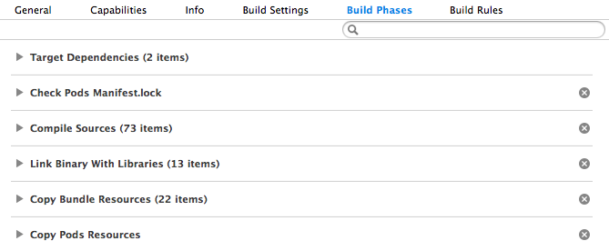
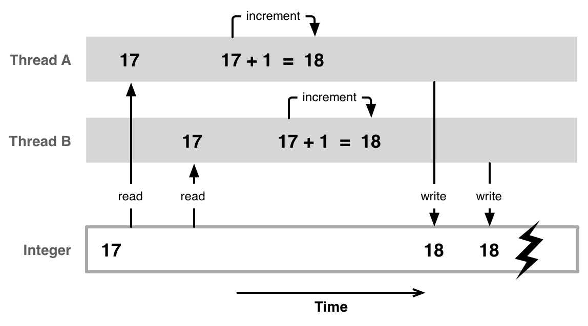
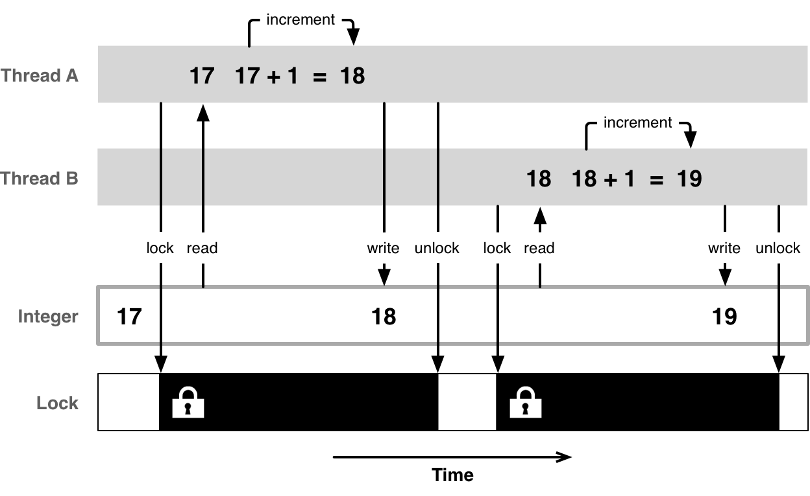
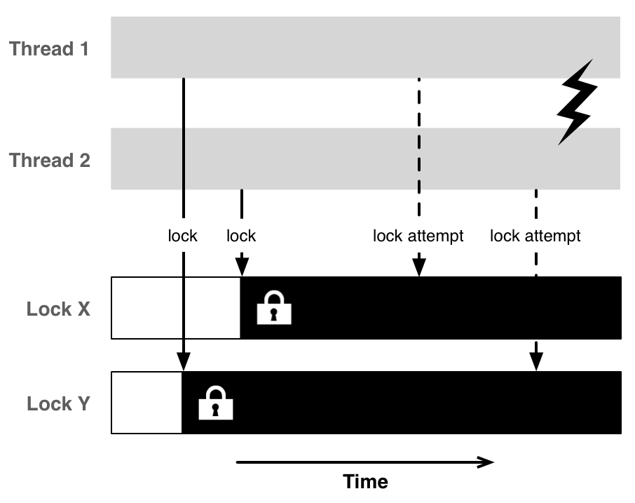
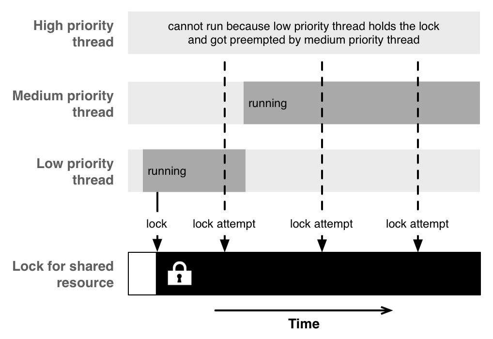

## objc.io Notes

### 1. [The Build Process](https://www.objc.io/issues/6-build-tools/build-process/)

* 工程有多个Target，按照依赖顺序进行生成。在`Log Navigator`中看到基本信息，如下

```
Build target Pods-SSZipArchive
...
Build target Makefile-openssl
...
Build target Pods-AFNetworking
...
Build target crypto
...
Build target Pods
...
Build target ssl
...
Build target objcio
```
如果要看到所有编译日志，可以选择`All`和`All Messages`，然后点击`Save...`，也可以`Editor`→`Copy transcript for shown results (All, All Messages) as Text`

* 针对每个Target生成，有自己编译过程（Build Phases）

上面的每个Build Phase按照一定顺序执行的

* 每个Build Phase下面执行很多任务，但是每个任务的日志格式基本一致，如下

```
(1) ProcessPCH /.../Pods-SSZipArchive-prefix.pch.pch Pods-SSZipArchive-prefix.pch normal armv7 objective-c com.apple.compilers.llvm.clang.1_0.compiler
    (2) cd /.../Dev/objcio/Pods
        setenv LANG en_US.US-ASCII
        setenv PATH "..."
    (3) /.../Xcode.app/.../clang 
            (4) -x objective-c-header 
            (5) -arch armv7 
            ... configuration and warning flags ...
            (6) -DDEBUG=1 -DCOCOAPODS=1 
            ... include paths and more ...
            (7) -c 
            (8) /.../Pods-SSZipArchive-prefix.pch 
            (9) -o /.../Pods-SSZipArchive-prefix.pch.pch
```


1. 第一行都是描述任务，一般以特定任务名开头，例如`ProcessPCH `。该任务下面的操作，都采用缩进显示。
2. 一些准备操作，cd、设置环境变量等
3. 调用特定命令。例如clang、ibtool等。一般命令会带很多的选项。下面以clang简单说明下
4. -x，指定编译文件的类型
5. -arch，指定编译的架构
6. -DDEBUG=1，……，设置预编译宏
7. -c，指定clang运行哪些操作
8. 源文件路径
9. 目标文件的格式和输出路径

整理一些常见Build Phase中的Task，如下

| Task名称 | 作用 |
|---|---|
| CompileC | 编译源文件(.m等) |
| Ld | 链接.o文件等，生成.app中的executable文件 |
| CompileStoryboard | 编译.storyboard文件 |
| ProcessInfoPlistFile | 生成.app/Info.plist文件 |
| CompileAssetCatalog | 处理.xcassets文件 | 
| LinkStoryboards | 链接.storyboardc文件 |
| PhaseScriptExecution | 执行Run Script |
| Touch | 使用touch命令更新.app文件 |
| CodeSign | 对.app文件签名 |
| ProcessPCH | 处理.pch文件 |

* 对于某个特定类型的文件，需要用到`Build Rules`

>
> TODO list
>
1. 学习`Build Rules`的使用
2. 学习使用[ImageMagick](https://github.com/krzysztofzablocki/Bootstrap)给App Icon打水印


### 2. [Concurrent Programming: API and Chanllenges](https://www.objc.io/issues/2-concurrency/concurrency-apis-and-pitfalls/)

（1）GCD Thread Pool模式


* GCD内部维护线程池管理线程，按照queue模型使用线程
* GCD默认提供5种队列：Main Queue、High/Default/Low Priority Queue、Background Priority Queue，Background Priority比Low Priority还低一些
* 自定义queue有2种：串行（Serial）和并行（Concurrent），推荐使用Default Priority。

（2）Operation Queues

* Operation Queue是基于GCD的封装，提供一些API（`isExecuting`、`isFinished`）方便查询任务的状态
* Operation Queue有2种类型：main queue和custom queue，main queue执行在main thread上，而custom queue执行在background thread

（3）并发编程任务：资源共享（Sharing of Resources）

* Race Condition

资源共享涉及到Race Condition问题，一个典型的Race Condition例子，如下




* Mutual Exclusion

互斥操作可以解决Race Condition问题，如下



Note：互斥操作一般可以使用Lock，加锁和解锁都一定开销，同时存在Lock Contention，即多个线程对同一个已经加过锁的锁尝试加锁，这时不同的Lock表现不同的系统开销。

* Dead Lock

互斥操作，也有缺陷，即存在死锁（Dead Lock）情况，如下



* Starvation

使用Lock，也存在饿死（Starvation）情况，举个例子，共享资源有读和写两种锁：读锁存在的时候，不能加写锁；写锁存在的时候，不能加读锁。如果读锁一直存在，则写锁始终加不上，出现饿死情况。

* Priority Inversion

GCD提供有优先级的队列，但是优先级队列存在优先级反转（Priority Inversion）问题。举个例子，如下


上面这种情况，Medium priority thread优先High priority thread执行，即出现Priority Inversion。

### 3. [Mach-O Executables](https://www.objc.io/issues/6-build-tools/mach-o-executables/)

#### (1) xcrun命令

xcrun用于多个Xcode版本存在的情况下，定位被调用命令的位置，然后调用该命令，以及指定特定的SDK版本。例如

$ clang -v

也可以换成

$ xcrun clang -v


#### (2) 编译器的执行过程

| 过程 | 特定操作 |
|-----|---------|
| Preprocessing | • Tokenization<br/>• Macro expansion<br/>• `#include` expansion
| Parsing & Semantic Analysis | • Translate preprocessor tokens into a parse tree<br/>• Apply semantic analysis to the parse tree<br/>• Output an <i>Abstract Syntax Tree</i> (AST)
| Code Generation & Optimization | • Translate an AST into low-level intermediate code (LLVM IR)<br/>• Responsible for optimizing the generated code<br/>• target-specific code generation<br/>• Output assembly
| Assembler | Translate assembly code into a target object file |
| Linker | Merge mutiple object files into an executable (or a dynamic library)

* Preprocessing

```
$ xcrun clang -E helloworld.c | open -f
```

-E选项，输出预处理后的代码，除了`#include`和`#import`导入的一些代码，会有一些<b>行标记语句</b>（linemarker statement）

```
$ cat -n helloworld.c 
1	#include <stdio.h>
2	int main(int argc, char *argv[])
3	{
4	    printf("Hello World!\n");
5	    return 0;
6	}
```

经过预处理后，部分代码如下

```
...
extern int __vsnprintf_chk (char * restrict, size_t, int, size_t,
       const char * restrict, va_list);
# 501 "/Applications/Xcode.app/Contents/Developer/Platforms/MacOSX.platform/Developer/SDKs/MacOSX10.13.sdk/usr/include/stdio.h" 2 3 4
# 2 "helloworld.c" 2
int main(int argc, char *argv[])
{
    printf("Hello World!\n");
    return 0;
}
```
行标记语句总是插入在`#include`展开的那一行，其格式是<b># line_number "path/to/file" flag</b>

line_number，指示插入所在行的行号    
path/to/file，指示插入代码所属文件的路径    
flag，也是数字。1代表新文件，2代表回到上个文件，3代表系统头文件

插入代码采用递归方式，所以上面#include \<stdio.h\>，插入不是预处理后代码的顶部，而是在最下面main函数的上一行。

>
1. 手动在代码中，写linemarker语句，编译器是不报错的
2. Xcode中Product -> Perform Action -> Preprocess，可以输出预处理代码

* Compilation

```
$ xcrun clang -S -o - helloworld.c | open -f
```
上面用于生成对应的汇编代码，Xcode中也可以Product -> Perform Action -> Assemble。

汇编代码，如下

```
	.section	__TEXT,__text,regular,pure_instructions
	.macosx_version_min 10, 13
	.globl	_main
	.p2align	4, 0x90
_main:                                  ## @main
	.cfi_startproc
## BB#0:
	pushq	%rbp
Lcfi0:
	.cfi_def_cfa_offset 16
Lcfi1:
	.cfi_offset %rbp, -16
	movq	%rsp, %rbp
Lcfi2:
	.cfi_def_cfa_register %rbp
	subq	$32, %rsp
	leaq	L_.str(%rip), %rax
	movl	$0, -4(%rbp)
	movl	%edi, -8(%rbp)
	movq	%rsi, -16(%rbp)
	movq	%rax, %rdi
	movb	$0, %al
	callq	_printf
	xorl	%ecx, %ecx
	movl	%eax, -20(%rbp)         ## 4-byte Spill
	movl	%ecx, %eax
	addq	$32, %rsp
	popq	%rbp
	retq
	.cfi_endproc

	.section	__TEXT,__cstring,cstring_literals
L_.str:                                 ## @.str
	.asciz	"Hello World!\n"


.subsections_via_symbols
```

基本语法

* 汇编指令，以点开头，例如.section、.globl等，
* 标号（Labels），以冒号为后缀，例如_main:、Lcfi0:等
* 其他的是汇编代码，例如movq、subq等

常见汇编指令的用法

* .section，描述下面紧跟着的语句，属于哪种section，section类型有__TEXT、__DATA等
* .globl，描述后面是一个外部符号（external symbol），例如_main是一个外部符号，是系统调用可执行文件的入口
* .p2align/.align，描述后面代码的对齐方式，例如.p2align	4, 0x90，按照16 bytes对齐（2^4），使用0x90填充
* .cfi_startproc，描述函数的开始部分
* .cfi_endproc，描述函数的结束部分

常见汇编相关缩写

* CFI，Call Frame Information，一个CFI相当于一个函数，调试时step in/out就是进入或跳出CFI，也直接称call frame或frame
* ABI，Application Binary Interface，描述函数如何在汇编代码中调用以及相关约定。例如约定rbp寄存器（base pointer register），必须用于保存现场地址，所以在进入函数之前，可以push %rbp保存现场；函数返回时，可以pop %rbp恢复现场


#### (3) 二进制文件中的section

可执行文件，包含多个section，section组成segment。

使用size工具可以查看segment和section，例如

```
xcrun size -x -l -m a.out
Segment __PAGEZERO: 0x100000000 (vmaddr 0x0 fileoff 0)
Segment __TEXT: 0x1000 (vmaddr 0x100000000 fileoff 0)
	Section __text: 0x34 (addr 0x100000f50 offset 3920)
	Section __stubs: 0x6 (addr 0x100000f84 offset 3972)
	Section __stub_helper: 0x1a (addr 0x100000f8c offset 3980)
	Section __cstring: 0xe (addr 0x100000fa6 offset 4006)
	Section __unwind_info: 0x48 (addr 0x100000fb4 offset 4020)
	total 0xaa
Segment __DATA: 0x1000 (vmaddr 0x100001000 fileoff 4096)
	Section __nl_symbol_ptr: 0x10 (addr 0x100001000 offset 4096)
	Section __la_symbol_ptr: 0x8 (addr 0x100001010 offset 4112)
	total 0x18
Segment __LINKEDIT: 0x1000 (vmaddr 0x100002000 fileoff 8192)
total 0x100003000
```
命令选项说明
>
-x，使用十六进制     
-m，使用Darwin格式打印   
-l，配置-m使用，输出包含地址和偏移量

<b>段（segment）的类型</b>

* __TEXT段，映射到内存为readonly和executable，对应的page总是dirty
* __DATA段，映射到内存为read/write，但不是executable
* __PAGEZERO段，映射到内存为non-executable、non-writable和non-readable，大小为4GB，但实际在二进制文件中不占4GB。如果访问到这4GB内存地址，则会出现EXC\_BAD\_ACCESS

__TEXT段下面的section

* __text区，包含编译的机器码
* __stubs区和__stub_helper区，dyld会使用这两个section，用于动态地lazy link代码
* __const区，包含常量
* __cstring区，包含字面字符串。例如上面的"Hello World!\n"

__DATA段下面的section

* \__nl\_symbol\_ptr区和__la\_symbol\_ptr区，分别代表non-lazy和lazy符号指针（symbol pointer）。lazy符号指针用于可执行文件调用未定义的函数（例如函数实现不在可执行文件中），而non-lazy符号指针用于可执行文件加载时处理。
* __const区，包含需要重定位的常量数据，例如char * const p = "foo"，指针p是const，但指向的数据不是const，所以p存在__const区中
* __bss区，包含未初始化的静态变量，例如static int a;（ANSI C标准约定静态变量默认是0）
* __common区，包含未初始化的全局变量，例如全局变量int a;
* __dyld区，被dyld使用（目前未见到）

<b>使用otool命令查看二进制文件内容</b>

* 查看section内容

查看__TEXT,__text区

```
$ xcrun otool -s __TEXT __text a.out 
a.out:
Contents of (__TEXT,__text) section
0000000100000f50	55 48 89 e5 48 83 ec 20 48 8d 05 47 00 00 00 c7 
0000000100000f60	45 fc 00 00 00 00 89 7d f8 48 89 75 f0 48 89 c7 
0000000100000f70	b0 00 e8 0d 00 00 00 31 c9 89 45 ec 89 c8 48 83 
0000000100000f80	c4 20 5d c3 
```

查看__TEXT,__cstring区

```
xcrun otool -v -s __TEXT __cstring a.out 
a.out:
Contents of (__TEXT,__cstring) section
0000000100000fa6  Hello World!\n
```

* 查看section对应的汇编代码

```
$ xcrun otool -s __TEXT __text -v a.out
a.out:
(__TEXT,__text) section
_main:
0000000100000f50	pushq	%rbp
0000000100000f51	movq	%rsp, %rbp
0000000100000f54	subq	$0x20, %rsp
0000000100000f58	leaq	0x47(%rip), %rax
0000000100000f5f	movl	$0x0, -0x4(%rbp)
0000000100000f66	movl	%edi, -0x8(%rbp)
0000000100000f69	movq	%rsi, -0x10(%rbp)
0000000100000f6d	movq	%rax, %rdi
0000000100000f70	movb	$0x0, %al
0000000100000f72	callq	0x100000f84
0000000100000f77	xorl	%ecx, %ecx
0000000100000f79	movl	%eax, -0x14(%rbp)
0000000100000f7c	movl	%ecx, %eax
0000000100000f7e	addq	$0x20, %rsp
0000000100000f82	popq	%rbp
0000000100000f83	retq
```

* 查看Mach Header

```
$ otool -v -h a.out 
Mach header
      magic cputype cpusubtype  caps    filetype ncmds sizeofcmds      flags
MH_MAGIC_64  X86_64        ALL LIB64     EXECUTE    15       1200   NOUNDEFS DYLDLINK TWOLEVEL PIE
```

这里ncmds代表有15个Load Command

* 查看Load Commands

```
otool -v -l a.out 
a.out:
Mach header
      magic cputype cpusubtype  caps    filetype ncmds sizeofcmds      flags
MH_MAGIC_64  X86_64        ALL LIB64     EXECUTE    15       1200   NOUNDEFS DYLDLINK TWOLEVEL PIE
Load command 0
      cmd LC_SEGMENT_64
  cmdsize 72
  segname __PAGEZERO
   vmaddr 0x0000000000000000
   vmsize 0x0000000100000000
  fileoff 0
 filesize 0
  maxprot ---
 initprot ---
   nsects 0
    flags (none)
...
```

这里initprot代表segment的权限，例如Load command 1中`initprot r-x`，说明有read/executable权限。

以__TEXT,__text区，简单分析下

```
Section
  sectname __text
   segname __TEXT
      addr 0x0000000100000f50
      size 0x0000000000000034
    offset 3920
     align 2^4 (16)
    reloff 0
    nreloc 0
      type S_REGULAR
attributes PURE_INSTRUCTIONS SOME_INSTRUCTIONS
 reserved1 0
 reserved2 0
```

addr，section的起始地址   
size，section的大小    
offset，section在二进制中的偏移量   
align，对齐大小   

* 查看链接的动态库

```
$ xcrun otool -v -L a.out 
a.out:
	/usr/lib/libSystem.B.dylib (compatibility version 1.0.0, current version 1252.0.0)
```

这里_printf符号的定义属于libSystem.B.dylib中

<b>添加任意section</b>

clang支持添加任意的section，例如

```
$ xcrun clang helloworld.c -Wl,-sectcreate,__TEXT,__info_plist,./Info.plist -o a_with_InfoPlist.out

$ xcrun size -x -l -m a_with_InfoPlist.out 
Segment __PAGEZERO: 0x100000000 (vmaddr 0x0 fileoff 0)
Segment __TEXT: 0x1000 (vmaddr 0x100000000 fileoff 0)
	Section __text: 0x34 (addr 0x100000e60 offset 3680)
	Section __stubs: 0x6 (addr 0x100000e94 offset 3732)
	Section __stub_helper: 0x1a (addr 0x100000e9c offset 3740)
	Section __cstring: 0xe (addr 0x100000eb6 offset 3766)
	Section __info_plist: 0xec (addr 0x100000ec4 offset 3780)
	Section __unwind_info: 0x48 (addr 0x100000fb0 offset 4016)
	total 0x196
Segment __DATA: 0x1000 (vmaddr 0x100001000 fileoff 4096)
	Section __nl_symbol_ptr: 0x10 (addr 0x100001000 offset 4096)
	Section __la_symbol_ptr: 0x8 (addr 0x100001010 offset 4112)
	total 0x18
Segment __LINKEDIT: 0x1000 (vmaddr 0x100002000 fileoff 8192)
total 0x100003000
```

`-Wl,<arg>`，为linker指定参数arg。这里使用-sectcreate添加__TEXT,__info_plist区，其内容是路径为./Info.plist的文件内容

>
除了可以指定-sectcreate，还是指定-sectalign（用于对齐方式）、-segprot（用于指定read/write/executable等）。具体参考man ld。

#### (4) 编译多个文件的例子

为下面为例

Foo.h

```
#import <Foundation/Foundation.h>

@interface Foo : NSObject
- (void)run;
@end
```

Foo.m

```
#import "Foo.h"

@implementation Foo
- (void)run
{
    NSLog(@"%@", NSFullUserName());
}
@end
```

helloworld.m

```
#import "Foo.h"

int main(int argc, char *argv[])
{
    @autoreleasepool {
        Foo *foo = [[Foo alloc] init];
        [foo run];
        return 0;
    }
}
```

生成.o文件

```
$ xcrun clang -c Foo.m
$ xcrun clang -c helloworld.m
```

链接.o文件，生成可执行文件

```
xcrun clang helloworld.o Foo.o -Wl,`xcrun --show-sdk-path`/System/Library/Frameworks/Foundation.framework/Foundation -o a_with_mutiple_files.out
```

nm命令的使用

```
$ xcrun nm -nm helloworld.o
                 (undefined) external _OBJC_CLASS_$_Foo
                 (undefined) external _objc_autoreleasePoolPop
                 (undefined) external _objc_autoreleasePoolPush
                 (undefined) external _objc_msgSend
0000000000000000 (__TEXT,__text) external _main
```

_OBJC_CLASS_$_Foo，表示Objective-C的Foo类，是undefined, external符号。

_main，表示main函数，位于__TEXT,__text区，而有自己的地址空间，由于外部需要调用它，所以也是external符号，但实现在.o中，所以不是undefined。

>
external表示这个符号不是这个.o文件私有的，对其他文件是可见的

```
$ xcrun nm -nm Foo.o
                 (undefined) external _NSFullUserName
                 (undefined) external _NSLog
                 (undefined) external _OBJC_CLASS_$_NSObject
                 (undefined) external _OBJC_METACLASS_$_NSObject
                 (undefined) external ___CFConstantStringClassReference
                 (undefined) external __objc_empty_cache
0000000000000000 (__TEXT,__text) non-external -[Foo run]
0000000000000060 (__DATA,__objc_const) non-external l_OBJC_METACLASS_RO_$_Foo
00000000000000a8 (__DATA,__objc_const) non-external l_OBJC_$_INSTANCE_METHODS_Foo
00000000000000c8 (__DATA,__objc_const) non-external l_OBJC_CLASS_RO_$_Foo
0000000000000110 (__DATA,__objc_data) external _OBJC_METACLASS_$_Foo
0000000000000138 (__DATA,__objc_data) external _OBJC_CLASS_$_Foo
```

Foo.o也存在undefined, external符号。有些符号的实现在.o中，所以有对应的地址空间。

```
xcrun nm -nm a_with_mutiple_files.out 
                 (undefined) external _NSFullUserName (from Foundation)
                 (undefined) external _NSLog (from Foundation)
                 (undefined) external _OBJC_CLASS_$_NSObject (from CoreFoundation)
                 (undefined) external _OBJC_METACLASS_$_NSObject (from CoreFoundation)
                 (undefined) external ___CFConstantStringClassReference (from CoreFoundation)
                 (undefined) external __objc_empty_cache (from libobjc)
                 (undefined) external _objc_autoreleasePoolPop (from libobjc)
                 (undefined) external _objc_autoreleasePoolPush (from libobjc)
                 (undefined) external _objc_msgSend (from libobjc)
                 (undefined) external dyld_stub_binder (from libSystem)
0000000100000000 (__TEXT,__text) [referenced dynamically] external __mh_execute_header
0000000100000e80 (__TEXT,__text) external _main
0000000100000f00 (__TEXT,__text) non-external -[Foo run]
0000000100001138 (__DATA,__objc_data) external _OBJC_METACLASS_$_Foo
0000000100001160 (__DATA,__objc_data) external _OBJC_CLASS_$_Foo
```

linker把.o文件做链接，同时把一些符号重新resolve，比如undefined符号被分配地址空间或者指定动态库，例如helloworld.o中的_OBJC_CLASS_$_Foo符号被分配到__DATA,__objc_data区；_NSFullUserName符号被指定引用自Foundation动态库

除了链接动态库的名称，使用otool命令可以查看可执行文件需要依赖的动态库。

```
$ xcrun otool -L a_with_mutiple_files.out 
a_with_mutiple_files.out:
	/System/Library/Frameworks/Foundation.framework/Versions/C/Foundation (compatibility version 300.0.0, current version 1450.15.0)
	/usr/lib/libSystem.B.dylib (compatibility version 1.0.0, current version 1252.0.0)
	/System/Library/Frameworks/CoreFoundation.framework/Versions/A/CoreFoundation (compatibility version 150.0.0, current version 1450.15.0)
	/usr/lib/libobjc.A.dylib (compatibility version 1.0.0, current version 228.0.0)
```

仍然是undefined但是有链接动态库信息的符号，在运行时有dyld去处理。例如_NSFullUserName符号，在运行时，dyld会去Foundation中查找实现。

```
$ xcrun nm -nm `xcrun --show-sdk-path`/System/Library/Frameworks/Foundation.framework/Foundation | grep NSFullUserName
0000000000007f3e (__TEXT,__text) external _NSFullUserName
```
可以直接去Foundation.framework下面找到这个符号，由于Foundation二进制文件换成了Foundation.tbd文件，这个文件是文本文件可以直接搜索_NSFullUserName符号。

```
(export DYLD_PRINT_LIBRARIES=; ./a_with_mutiple_files.out 
subsh> )
dyld: loaded: /Users/wesley_chen/GitHub_Projcets/LearningNotes/objc.io/code/03_mach_o/./a_with_mutiple_files.out
dyld: loaded: /System/Library/Frameworks/Foundation.framework/Versions/C/Foundation
dyld: loaded: /usr/lib/libSystem.B.dylib
...
2017-12-30 16:59:23.055 a_with_mutiple_files.out[86875:8474416] wesley_chen
```

使用DYLD_PRINT_LIBRARIES环境变量，可以打印执行可执行文件之前加载的动态库

由于执行可执行文件之前，需要加载很多的动态库，这个过程比较长，因此dyld会有一个shared cache存在，位于/var/db/dyld/，动态库直接缓存这个目录下。

## TODO Readings

1. https://www.objc.io/issues/2-concurrency/common-background-practices/
2. https://www.objc.io/issues/2-concurrency/low-level-concurrency-apis/

