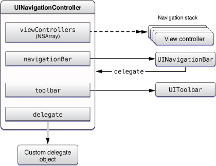
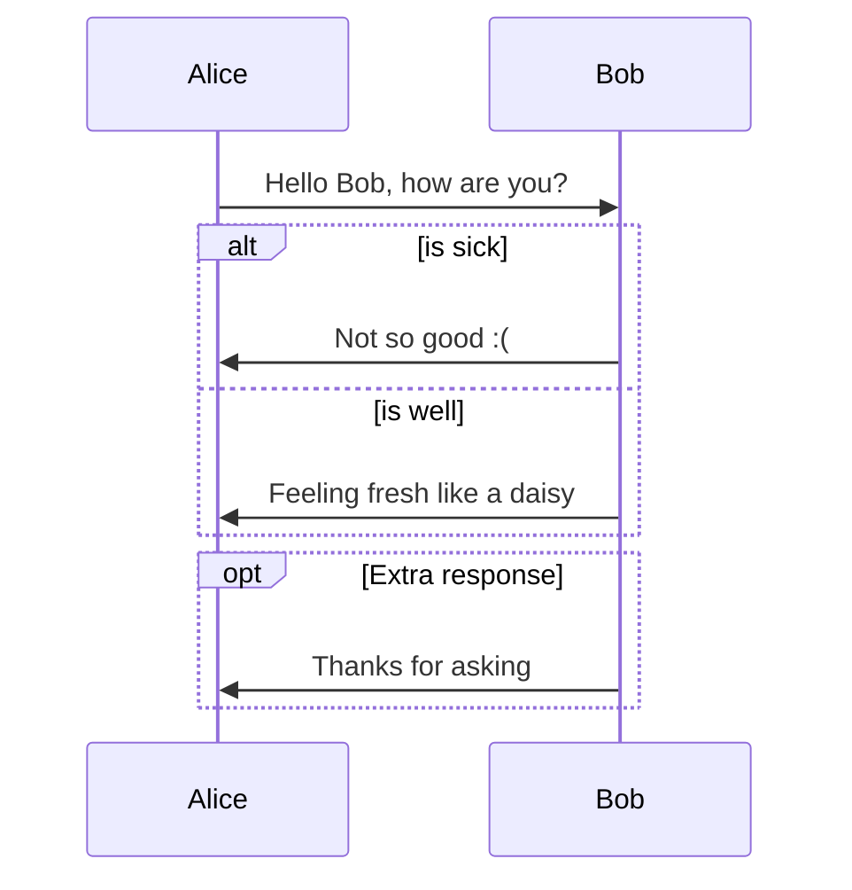
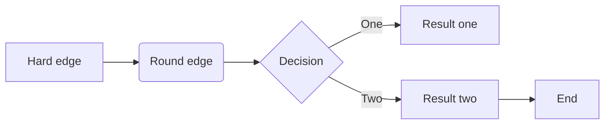
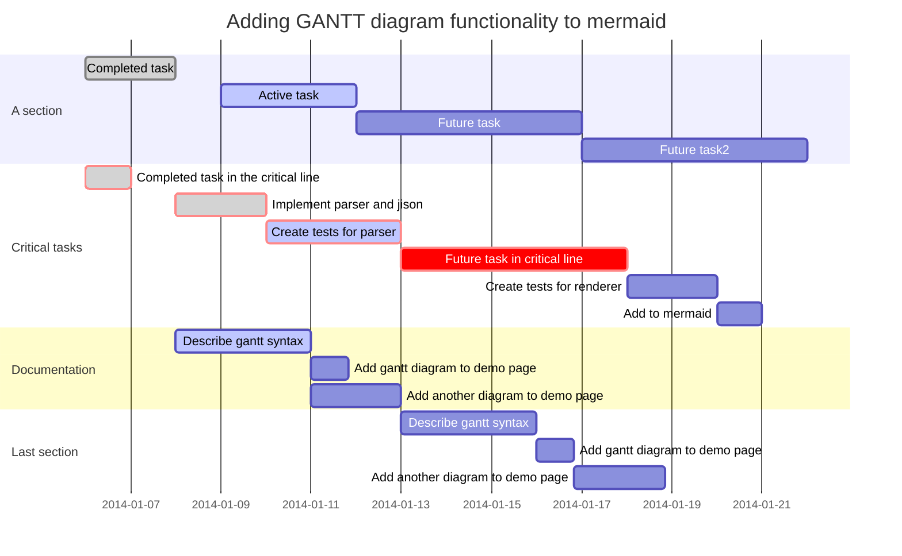
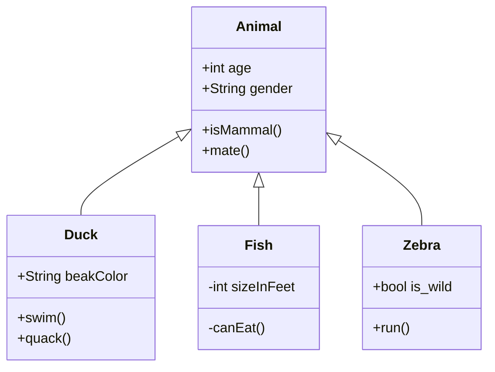
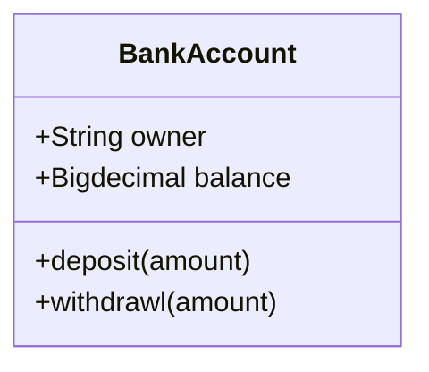
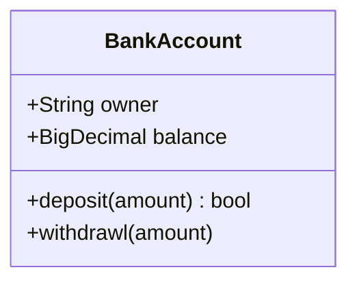
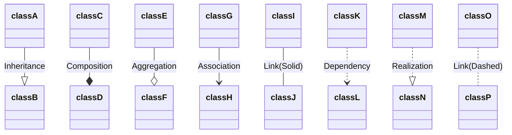
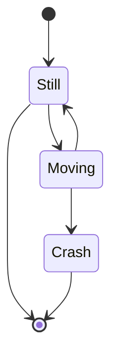
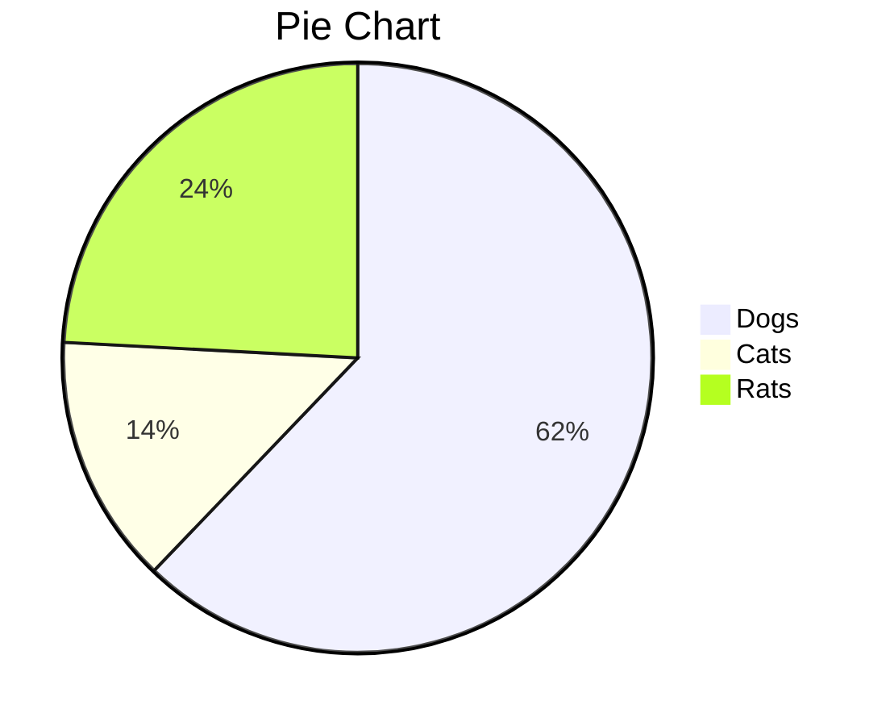

## 使用Typora

[TOC]


## 1、特殊的格式化

### (1) 圆形框

```
<kbd>System Preferences</kbd>
```

Go to <kbd>System Preferences</kbd> > <kbd>Extensions</kbd> > <kbd>Xcode Source Editor</kbd> > select <kbd>LinesSorter</kbd>


### (2) 图片对齐方式[^2]

* 左对齐


* 右对齐


* 居中




### (3) 文本前景颜色

#### a. 使用span标签

<span style="color:blue">使用span的例子</span>


#### b. 使用font标签

<font color="red">使用font的例子</font>


### (4) 文本背景颜色

#### a. 使用span标签

<span style="background-color:blue; color:white;">使用span的例子</span>


#### b. 使用div标签

<div style="background-color: rgb(255, 0, 0); color: white">
背景颜色
</div>


### (5) 文本背景圆角

<span style="background-color:blue; color:white; border-radius: 5px;">使用span的例子</span>


### (6) 可以折叠TOC目录

<details>
  <summary>Table of Contents</summary>
  <ol>
    <li>
      <a href="#description">Description</a>
    </li>
    <li>
      <a href="#usage">Usage</a>
      <ul>
        <li><a href="#get-the-code">Get the Code</a></li>
        <li><a href="#build">Build</a></li>
        <li><a href="#blas-build">BLAS Build</a></li>
        <li><a href="#prepare-data--run">Prepare Data & Run</a></li>
        <li><a href="#memorydisk-requirements">Memory/Disk Requirements</a></li>
        <li><a href="#quantization">Quantization</a></li>
        <li><a href="#interactive-mode">Interactive mode</a></li>
        <li><a href="#instruction-mode-with-alpaca">Instruction mode with Alpaca</a></li>
        <li><a href="#using-gpt4all">Using GPT4All</a></li>
        <li><a href="#using-pygmalion-7b--metharme-7b">Using Pygmalion 7B & Metharme 7B</a></li>
        <li><a href="#obtaining-the-facebook-llama-original-model-and-stanford-alpaca-model-data">Obtaining the Facebook LLaMA original model and Stanford Alpaca model data</a></li>
        <li><a href="#verifying-the-model-files">Verifying the model files</a></li>
        <li><a href="#seminal-papers-and-background-on-the-models">Seminal papers and background on the models</a></li>
        <li><a href="#perplexity-measuring-model-quality">Perplexity (measuring model quality)</a></li>
        <li><a href="#android">Android</a></li>
        <li><a href="#docker">Docker</a></li>
      </ul>
    </li>
    <li><a href="#contributing">Contributing</a></li>
    <li><a href="#coding-guidelines">Coding guidelines</a></li>
    <li><a href="#docs">Docs</a></li>
  </ol>
</details>

代码参考自https://raw.githubusercontent.com/ggerganov/llama.cpp/master/README.md


### (7) 图片带跳转链接

在markdown中图片有下面形式

* ``
* ``


图片带跳转链接，有下面几种形式[^3]

* `[](http://www.google.com)`

[](http://www.google.com)


* `[](http://www.google.com)`

[](http://www.google.com)


* `<a href="http://www.google.com"></a>`

<a href="http://www.google.com"></a>


### (8) 超链接

#### a. 空的超链接

有两种方式，如下

* `[PseudoLink]()`，[PseudoLink]()
* `[PseudoLink](#)`，[PseudoLink](#)


## 2、Typora支持的图[^1]

### (1) 时序图 (Sequence Diagrams)

```sequence
Alice->Bob: Hello Bob, how are you?
Note right of Bob: Bob thinks
Bob-->Alice: I am good thanks!
```

插件：https://github.com/bramp/js-sequence-diagrams

语法：https://bramp.github.io/js-sequence-diagrams/#syntax


### (2) 流程图 (Flowcharts)

```flow
st=>start: Start
op=>operation: Your Operation
cond=>condition: Yes or No?
e=>end

st->op->cond
cond(yes)->e
cond(no)->op
```

插件：http://flowchart.js.org/


### (3) Mermaid

Mermaid插件：https://mermaid-js.github.io/mermaid/#/


####a. 时序图 (Sequence Diagrams)



####b. 流程图 (Flowcharts)


####c. 甘特图 (Gantt Charts)



甘特图(Gantt diagram)是一种条线的图表，用于显示工程上的日程以及每个工程的耗时。甘特图也显示每个元素的起始时间和结束时间，以及每个工程的摘要信息。

mermaid文档对甘特图的描述[^4]，如下

> A Gantt chart is a type of bar chart, first developed by Karol Adamiecki in 1896, and independently by Henry Gantt in the 1910s, that illustrates a project schedule and the amount of time it would take for any one project to finish. Gantt charts illustrate number of days between the start and finish dates of the terminal elements and summary elements of a project.


####d. 类图 (Class Diagrams)



语法：https://mermaid-js.github.io/mermaid/#/classDiagram


##### d.1. 定义类

有两种方式，定义类

* 使用冒号`:`方式

```text
class BankAccount
BankAccount : +String owner
BankAccount : +BigDecimal balance
BankAccount : +deposit(amount)
BankAccount : +withdrawal(amount)
```




* 使用大括号`{}`方式

```text
class BankAccount{
  +String owner
  +BigDecimal balance
  +deposit(amount) bool
  +withdrawl(amount)
}
```



类图分为3个部分：

* 顶部部分：类名
* 中间部分：类的成员变量。语法结构：`<accessibility><ReturnType> propertyName`
* 底部部分：类的方法，一般需要一对括号表示这是个方法，而不是成员变量。语法结构：`<accessibility> methodName(<parameter>) <ReturnType>`


##### d.2. 定义两个类的关系

| Type  | Description   |
| ----- | ------------- |
| <\|-- | Inheritance   |
| *--   | Composition   |
| o--   | Aggregation   |
| -->   | Association   |
| --    | Link (Solid)  |
| ..>   | Dependency    |
| ..\|> | Realization   |
| ..    | Link (Dashed) |




c. TODO

UML Relationship
1、http://umich.edu/~eecs381/handouts/UMLNotationSummary.pdf
2、https://www.comp.nus.edu.sg/~cs2103/AY1516S1/files/UML%20reference%20sheet.pdf
3、https://creately.com/blog/diagrams/class-diagram-relationships/

4、https://www.guru99.com/uml-cheatsheet-reference-guide.html

5、https://medium.com/@smagid_allThings/uml-class-diagrams-tutorial-step-by-step-520fd83b300b

6、https://medium.com/@smagid_allThings/uml-class-diagram-example-fab6197200e6

7、https://loufranco.com/wp-content/uploads/2012/11/cheatsheet.pdf


####e. 状态图 (State Diagrams)



####f. 饼状图 (Pie Charts)




## References

[^1]:https://support.typora.io/Draw-Diagrams-With-Markdown/

[^2]:https://stackoverflow.com/questions/255170/markdown-and-image-alignment

[^3]:https://meta.stackexchange.com/questions/38915/creating-an-image-link-in-markdown-format

[^4]:https://mermaid-js.github.io/mermaid/#/gantt

