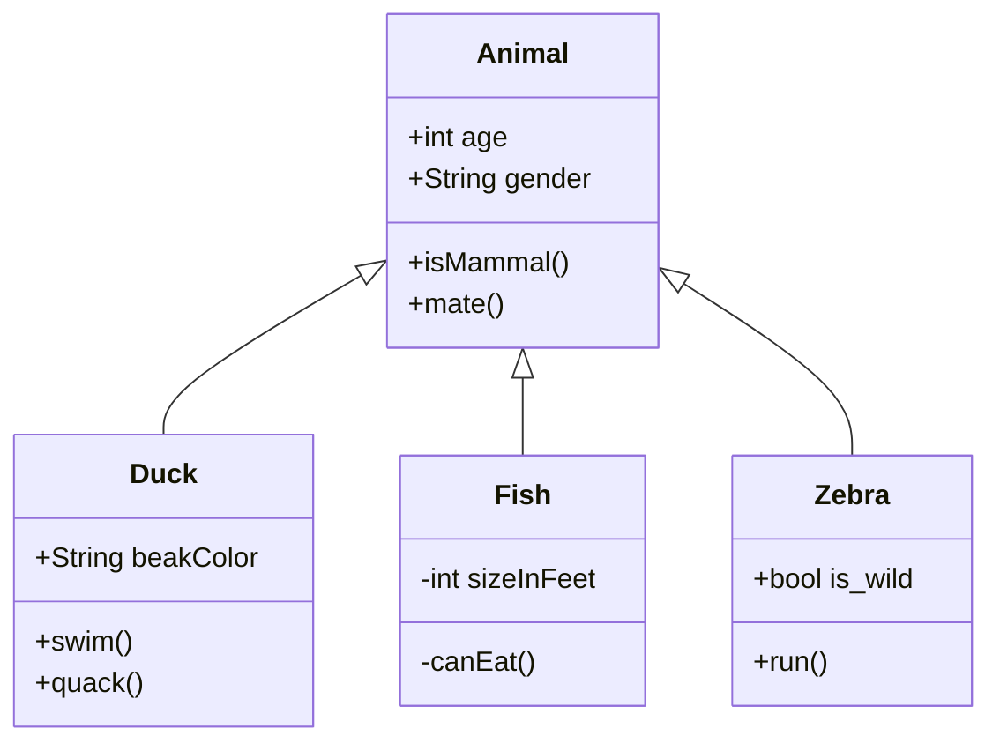

# Typora支持的图[^1]

[TOC]

## 1、时序图 (Sequence Diagrams)

```sequence
Alice->Bob: Hello Bob, how are you?
Note right of Bob: Bob thinks
Bob-->Alice: I am good thanks!
```

插件：https://github.com/bramp/js-sequence-diagrams

语法：https://bramp.github.io/js-sequence-diagrams/#syntax


## 2、流程图 (Flowcharts)

```flow
st=>start: Start
op=>operation: Your Operation
cond=>condition: Yes or No?
e=>end

st->op->cond
cond(yes)->e
cond(no)->op
```

插件：http://flowchart.js.org/


## 3、Mermaid

Mermaid插件：https://mermaid-js.github.io/mermaid/#/


###（1）时序图 (Sequence Diagrams)


###（2）流程图 (Flowcharts)


###（3）甘特图 (Gantt Charts)


###（4）类图 (Class Diagrams)



语法：https://mermaid-js.github.io/mermaid/#/classDiagram


#### a. 定义类

有两种方式，定义类

* 使用冒号`:`方式

```text
class BankAccount
BankAccount : +String owner
BankAccount : +BigDecimal balance
BankAccount : +deposit(amount)
BankAccount : +withdrawal(amount)
```


* 使用大括号`{}`方式

```text
class BankAccount{
  +String owner
  +BigDecimal balance
  +deposit(amount) bool
  +withdrawl(amount)
}
```


类图分为3个部分：

* 顶部部分：类名
* 中间部分：类的成员变量
* 底部部分：类的方法，一般需要一对括号表示这是个方法，而不是成员变量


#### b. 定义两个类的关系

| Type  | Description   |
| ----- | ------------- |
| <\|-- | Inheritance   |
| *--   | Composition   |
| o--   | Aggregation   |
| -->   | Association   |
| --    | Link (Solid)  |
| ..>   | Dependency    |
| ..\|> | Realization   |
| ..    | Link (Dashed) |


###（5）状态图 (State Diagrams)


###（6）饼状图 (Pie Charts)


## References

[^1]:https://support.typora.io/Draw-Diagrams-With-Markdown/


